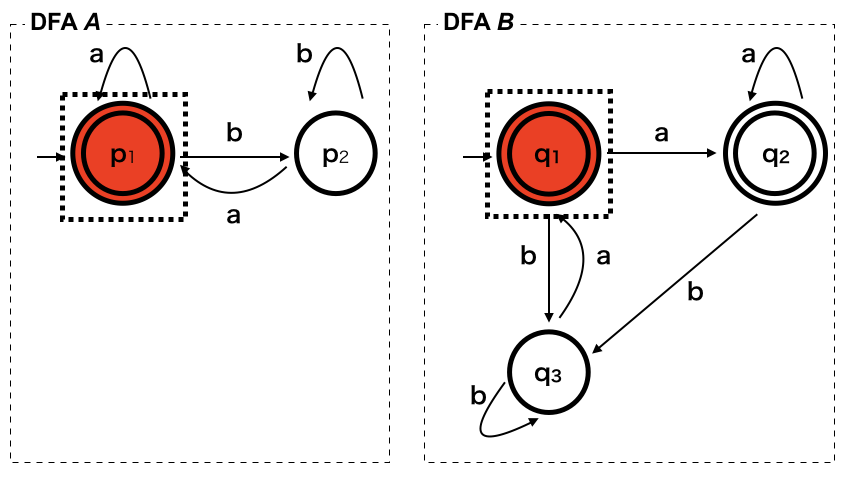

# 正規表現の等価性判定について

## さっき作った @make\_now\_just (2019/10/18 Regex Festa)

---

## 自己紹介

- HN: さっき作った
- Twitter: @make\_now\_just, GitHub: @MakeNowJust
- 大学生
- 好きなもの
  - 正規表現
  - プログラミング言語
  - Crystal, Scala, TypeScriptなど
  - アイマス

---

## 今日話すこと

1. **正規表現の等価性** = 「マッチする文字列の集合が等しい」
2. 正規表現の等価性の判定は可能
3. 正規表現の等価性判定のアルゴリズム

---

## 1. 正規表現の等価性

---

## 例え話

バリデーション用の正規表現が複雑になっている。

```text
/(?:[A-Za-z0-9+/]{4})*(?:[A-Za-z0-9+/]{3}=|[A-Za-z0-9+/]{2}==|[A-Za-z0-9+/]{1}===)?/
```

(Base64の文字列にマッチする正規表現のつもり)

---

## 例え話

2つの正規表現両方にマッチしたらok、というようにリファクタリングする。

1. `/(.{4})*/`
   長さが4の倍数
2. `/[A-Za-z0-9+/]*={0,3}/`
   Base64として有効な文字のあとに`=`が3個まで続く

---

## 例え話

この2つは**等しい**だろうか？

1. ```text
   /(?:[A-Za-z0-9+/]{4})*(?:[A-Za-z0-9+/]{3}=|[A-Za-z0-9+/]{2}==|[A-Za-z0-9+/]{1}===)?/
   ```

2. ```text
   /(.{4})*/ かつ /[A-Za-z0-9+/]*={0,3}/
   ```

---

## 正規表現の等価性

そもそも**等しい**とは？

少なくとも、見かけ上の等しさではなさそう。

片方の正規表現でマッチする文字列はもう片方でも全てマッチするし、
マッチしない文字列はもう片方でもマッチしない。
→**正規表現の等価性**

---

## 正規表現の等価性の判定は可能

なぜ？

1. 正規表現はDFA (決定性有限状態オートマトン)に変換できる
2. DFAは状態数を最小化できる
3. マッチする文字列の等しい最小のDFAは状態の名前を除いて一意 (同型)

2つの正規表現をDFAに変換して最小化して、適当な方法で同型かどうか判定すれば
等価性を判定できる。

$r_1 \equiv r_2 \stackrel{\text{def}}{\iff} \forall w. w \in L(r_1) \iff w \in L(r_2)$

---

## とはいえ

- 正規表現を毎回最小DFAまで変換していたら効率が悪い
- もっと効率の良いアルゴリズムがあるはず

---

## 2. 等価性判定のアルゴリズム

---

## DFAで判定する方法

概要

1. 2つの正規表現をDFAに変換する。
2. 2つのDFAを初期状態から、アルファベットの全ての文字について遷移していく。
   このとき遷移する状態の組を対応するものとしてマークしていく。
3. マークしたが一方が受理状態でもう一方がそうでない場合は等価でない。
   遷移できる全ての状態の対応が取れたら等価。

---

## DFAで判定する方法

コード

```javascript
const toDFA = re => /* 適当な方法で正規表現をDFAに変換 */;

const eqvDFA = (re1, re2) => {
  const [dfa1, dfa2] = [re1, re2].map(toDFA);          // DFAに変換
  const uf = new UnionFind();                          // 対応する状態を管理するUnion-Find木を用意
  const stack = [];

  uf.merge(dfa1.init, dfa2.init);                      // 初期状態を対応してるとマークしてスタックに追加
  stack.push([dfa1.init, dfa2.init]);

  while (stack.length !== 0) {
    const [q1, q2] = stack.pop();                      // スタックから状態の組を取り出す

    if (dfa1.accept.has(q1) !== dfa2.accept.has(q2)) { // 同じタイミングで受理状態にならなければ等価ではない
      return false;
    }

    for (const a of ALPHABET) {                        // 全てのアルファベットについて遷移を行う
      const p1 = uf.find(dfa1.trans(q1, a));
      const p2 = uf.find(dfa2.trans(q2, a));
      if (p1 !== p2) {                                 // 対応が分からない場合、対応してるとマークしてスタックに追加
        uf.merge(p1, p2);
        stack.push([p1, p2]);
      }
    }
  }

  return true;                                         // 遷移可能な全ての状態について対応してるとマークできれば等価
};
```

---

## DFAで判定する方法

次のような2つのDFA $A, B$に対して等価かどうか判定をする。


---

## DFAで判定する方法

ステップ1. 初期状態$p_1, q_1$を対応する状態としてマークする。



---

## DFAで判定する方法

ステップ2. 文字$\mathrm{a}$で遷移した先の状態$p_1, q_2$を対応する状態としてマークする。


---

## DFAで判定する方法

ステップ3. 文字$\mathrm{b}$で遷移した先の状態$p_2, q_3$を対応する状態としてマークする。


---

## DFAで判定する方法

ステップ4. 全ての状態が対応付けられて、遷移で対応が矛盾しないのでDFA $A, B$は等価。


---

## DFAで判定する方法

いいところ

- DFAを最小化するよりは効率的
- アルゴリズムが直感的で分かりやすい

問題点

- DFAを作る時点でコストが大きい

---

## NFAで判定する方法

- 「DFAで判定する方法」をベースに、状態遷移を状態の集合に対して行う。
- NFAをDFAに変換する方法(サブセット構成)を同時に行うようなイメージ。

前のものと大して変わらないのでコードは割愛。

---

## NFAで判定する方法

いいところ

- 正規表現からNFAへは簡単に変換できるので効率が良い

問題点

- そもそも正規表現の等価性を知りたいのにNFAを介さなきゃいけないのはどうなのか

---

## 正規表現の微分で判定する方法

- 正規表現自体を状態と見なして、正規表現の**微分**によって遷移を行う。
- 空文字列にマッチする場合は受理、そうでないときは非受理。

微分$d_c(r)$と空文字列にマッチするかの判定$\nu(r)$の定義(雰囲気)

$$
\begin{array}{cc}
\begin{array}{rl}
d_c(\varepsilon) = d_c(\emptyset) & = \emptyset \\
d_c(a)                            & = \begin{cases}
                                         \varepsilon  & a = c \\
                                         \emptyset & \mathrm{otherwise}
                                      \end{cases} \\
d_c(r_1 \mid r_2)                 & = d_c(r_1) \mid d_c(r_2) \\
d_c(r_1 \And r_2)                 & = d_c(r_1) \And d_c(r_2) \\
d_c(r_1 \cdot r_2)                & = d_c(r_1) \cdot r_2 \mid \nu(r_1) \cdot d_c(r_2) \\
d_c(r^\ast)                       & = d_c(r) \cdot r^\ast
\end{array} &
\begin{array}{rl}
\nu(\varepsilon)               & = \varepsilon \\
\nu(a) = \nu(\emptyset)        & = \emptyset \\
\nu(r_1 \mid r_2)              & = \nu(r_1) \mid \nu(r_2) \\
\nu(r_1 \And r_2)              & = \nu(r_1) \And \nu(r_2) \\
\nu(r_1 \cdot r_2)             & = \nu(r_1) \cdot \nu(r_2) \\
\nu(r^\ast)                    & = \varepsilon
\end{array}
\end{array}
$$

---

## 正規表現の微分で判定する方法

微分の部分のコード(`derive(c, re)`が$d_c(r)$に、`nullable(re)`が$\nu(r)$に相当)

```javascript
const derivate = (c, re) => {
  switch (re.kind) {
  case 'empty':
  case 'epsilon':
    return {kind: 'empty'};
  case  'char':
    return re.char === c ? {kind: 'epsilon'} : {kind: 'empty'};
  case 'union':
    const r1 = derivate(c, re.left);
    const r2 = derivate(c, re.right);
    // 可能な場合は単純化する
    if (r1.kind === 'empty') return r2;
    if (r2.kind === 'empty') return r1;
    if (equal(r1, r2)) return r1;
    return {kind: 'union', left: r1, right: r2};
  case 'intersection': /* 省略。定義に従って実装する */
  case 'concat':       /* 以下同様 */
  case 'repeat':
  }
};

const nullable = re => /* ν(r) の定義を実装 */;
```

---

## 正規表現の微分で判定する方法

コード

```javascript
const eqvDerivate = (re1, re2) => {
  const uf = new UnionFind();              // 対応する正規表現を管理するUnion-Find木を用意
  const stack = [];

  uf.merge(re1, re2);                      // 最初の正規表現を対応してるとマークしてスタックに追加
  stack.push([re1, re2]);

  while (stack.length !== 0) {
    const [r1, r2] = stack.pop()

    if (!equal(nullable(r1), nullable(r2))) {   // 同じタイミングで空文字列を受理できるようにならなければ等価でない
      return false;
    }

    for (const a of ALPHABET) {            // 全てのアルファベットについて微分を行う
      const d1 = uf.find(derivate(a, r1));
      const d2 = uf.find(derivate(a, r2));
      if (!equal(d1, d2)) {                // 対応が分からない場合、対応してるとマークしてスタックに追加
        uf.merge(d1, d2);
        stack.push([d1, d2]);
      }
    }
  }

  return true;                             // 微分によって現れる全ての正規表現について対応してるとマークできれば等価
};
```

---

## 正規表現の微分で判定する方法

いいところ

- 正規表現で完結している

問題点

- 正規表現をUnion-Findに格納するのに正規表現のハッシュを取るなどする必要があり、
  面倒だしあまり効率的でない

---

## 以上です

---

## 話せなかったことなど

- *equivalence*の訳は「等価性」なのか「同値性」なのか
  - 発表のタイトルを等価性としてしまったので等価性にしたけど
    同値性の方がいいのでは？
- 式変形による等価性の判定
  - 考えるまでもなく難しいので省略した
  - Kleene代数の公理化は有限個の等式では不可能、とかはちょっと話が逸れすぎだし
- 等価性が判定できるというのは意外とすごいこと
  - 例えば文脈自由言語の等価性判定は決定不能

---

## 話せなかったことなど

- 紹介したアルゴリズムのベンチマーク
  - 取ろうと思ったけど時間がなかった
- 正規表現の等価性判定はPSPACE-完全に属する問題らしい
- 実際の正規表現に部分マッチとか控え目な量化子とかあるけど、どうすればいいのか
  - よく分からない。重み付きオートマトンで特徴付けられるので
    重み付きオートマトンとして等価性が判定できればできそうな気がする。
  - ただ、重み付きオートマトンの等価性の判定が決定可能かどうかは
    体の性質に依るようだけど、感覚的には決定不能な気がする。
    (特に根拠はないので信用してはいけない)

---

参考文献

1. Almeida, Marco, Nelma Moreira, and Rogério Reis.
   ["Testing the equivalence of regular languages."](https://arxiv.org/abs/0907.5058) (2009).

(今回紹介した方法の「DFAで判定する方法」が参考文献での**HKi**に、
 「NFAで判定する方法」が**HKe**に、「正規表現の微分で判定する方法」が**AM**に相当する)
